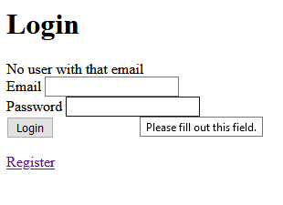
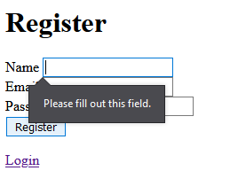
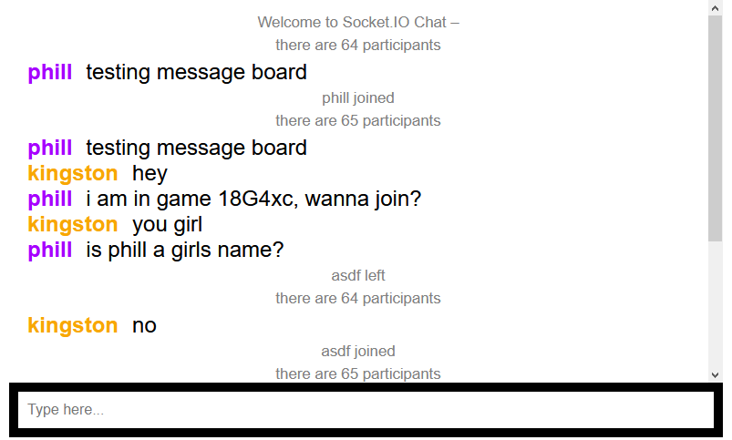
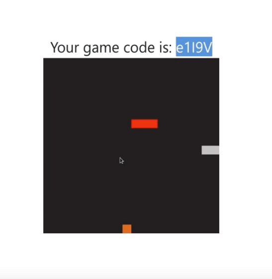
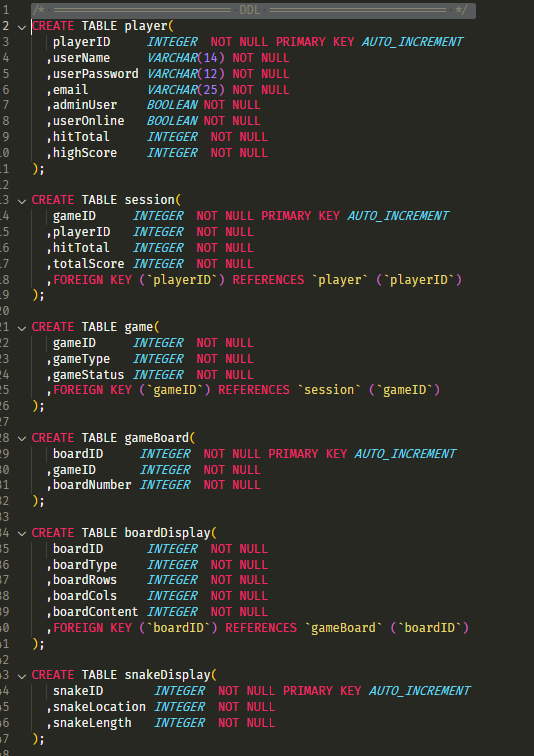

# MILESTONE ONE

## GAME DESCRIPTION

> ### BASE IDEA

The idea for this game is a multiplayer version of snake. The game will be a point based competition to see how many times a player can pick up the food without running into themselves, other players, or other obstacles. Levels will be point based and a minimum number of points must be collected before moving onto the next level. A leaderboard will be created tp represent the top scores.

> ### LOGGING IN
 
When the game is first accessed users will be asked to login, if a user account does not already exist for the user they may choose to create a new one. If the user attempts a login but it fails, then an error will appear asking them to check their username, password, or to create a new user.

> ### GAME LOBBY

Once the user is logged in they will be directed to a game lobby. The game lobby will host the levels and games currently available to them. A list of other users currently online will be visible as well. The user will have the choice to either join a current game or create a new one.

> ### GAMEPLAY

When the user enters gameplay they will be presented with a game screen that consists of current players, their scores, and other players snake character. Other players snakes will appear as a different color than their own and appear with a slight opacity to help distinguish them. Small collectible 'food' items will appear randomly on the board and when collected by a player will add a specific value to the players current score. Game levels will be distinguished by total points needed to complete, and the final level will be an  endless game that continues as long as the player doesn't collide with themself or with other players

> ### TWO PLAYER GAMES

Two player games will involve any two players competing in the same level for the points required to finish the level. When one of the players reaches the required score the game will end, and the player that reached the required score will continue to the next level while the losing player must restart the level. 

> ### OBJECTIVE AND SCORING
 
The objective of the game is simple, collect the food items to receive the points required to complete a level. Most levels will have a standard number of points assigned to a single food item. A special section of duel games will also be created with options to assign random values to food items and determine the score needed to complete the level.

> ### ADMINISTRATORS

A small group of users will be given administration rights and access to admin controls for games, users, and database related operations.

## STORYBOARDS

> ### LOGIN

The login screen will consist of an email and password input submitted via 'Login' button. There will also be a link to the register page. These storyboards are currently not styled, but the final design will be more aesthetically pleasing.

If a user tries to sign in with an email that is not registered, an error message will be displayed above the inputs. A similar message will be displayed if the password is incorrect.

> ### REGISTER

The registration screen will consist of a name, email, and password input submmited via the 'Register' button. There is also a link back to the login page incase a user navigates to the register page by accident

A number of different error warning will be displayed if information is input incorrectly or incompletely.

- Please fill out this field. (blank or incomplete Name, Email, or Password)
- Please enter a valid Email format. (invalid Email format)
- Please enter a password with at least 8 characters, including 1 uppercase letter, 1 lowercase letter, and 1 number (invalid password format)

> ### GAME LOBBY

The game lobby will consist two parts, the game portal(shown above) and the message board(shown below).

The game portal will allow players to create new games or join current games via a unique game code.

The message board will consist of a display area where messages are shown and a text input where the messages are entered. A list of current users will be displayed to the side of the message board. The bulk of the chat features will be run via [Socket.io](https://socket.io/), a useful real-time and event-based communication framework. The message board will be visible in the game lobby as well as during actual gameplay.

> ### GAME BOARD

The current game play display will look similar to the image above, but some colors will change to better differntiate between players and items. The game ID will be displayed above the game, and the score will be displayed below. If a second player joins, then their score will be shown along side the first players score.

- first player is shown as the red snake
- second player is shown as the grey snake
- the apple is shown as the orange square

> ### ADMIN CONTROLS

A screen for admin controls can be accessed by specific users with admin privelges. From the admin control screen they are able to create and delete users, create and delete current games, monitor the message board, and access most user info.

## ENTITY RELATIONSHIP DIAGRAM
[ERD DRAWIO FILE](files/ERD.drawio) for better viewing

I am aware that my ERD is missing some complexity. This is my third attempt at the ERD and I decided to dumb everything down to maintain simplicity. I am anticipating some parts to change and for additional tables to be added as the project further progresses along. 

## CRUD TABLE
[CRUD PDF](files/ERD.drawio) for better viewing

The diferrent entities are displayed on the left handside in dark grey and the attributes are listed along the top in green. The beginning of an entity table is designated by a light blue row.

My CRUD table is based from the example given in class. I anticipate mulitple modifications as the project continues.

## SQL

[link to myGame.sql file](files/myGame.sql)

These DDL statements will ultimately be modified as the project continues. For now this code will act as boilerplate for future modifications.

> #### DDL

> #### DML

 
