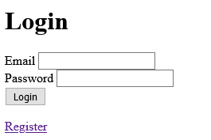
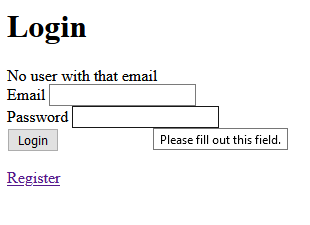
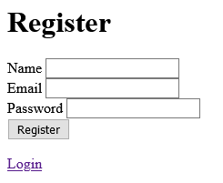
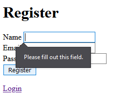
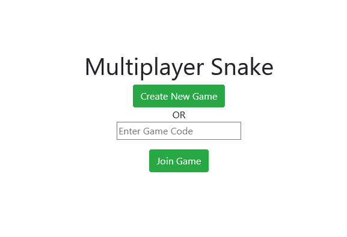
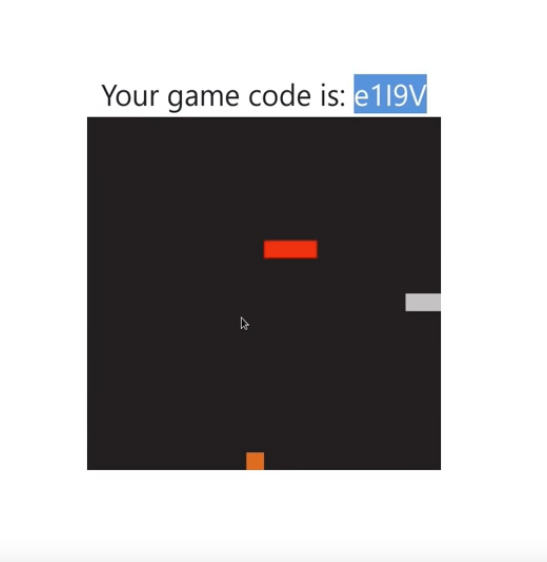
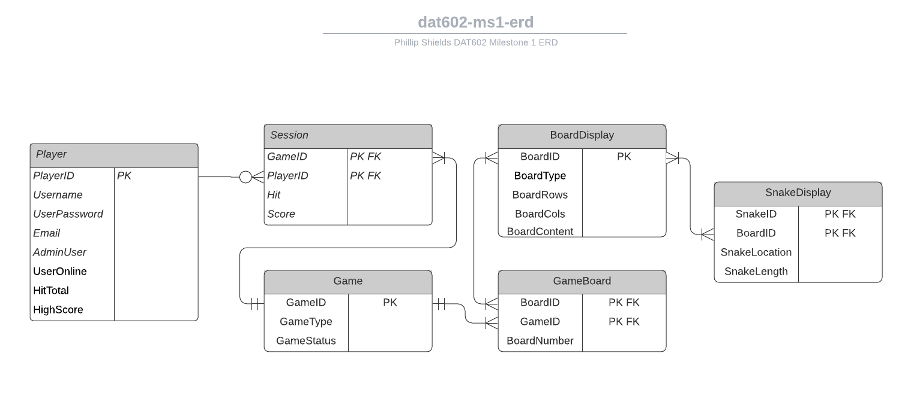
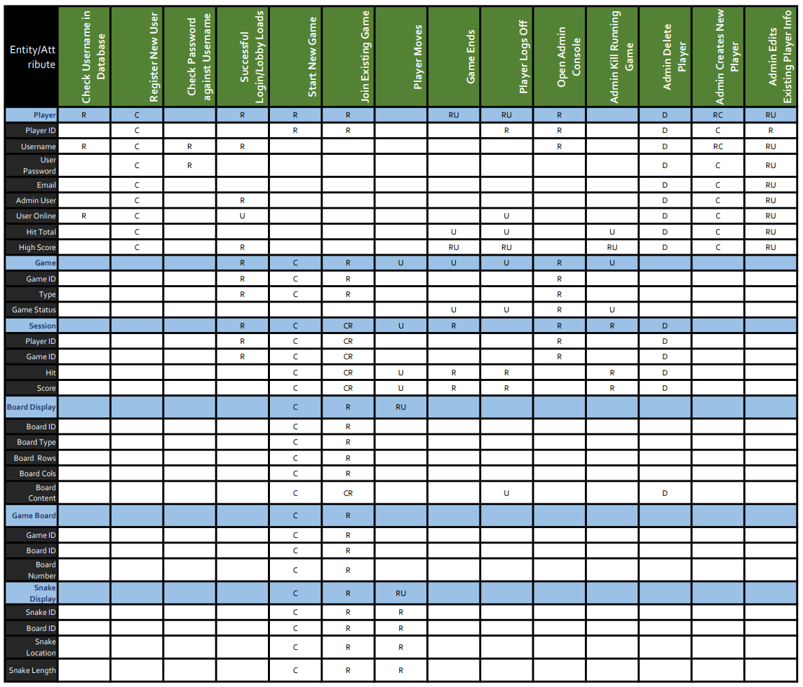
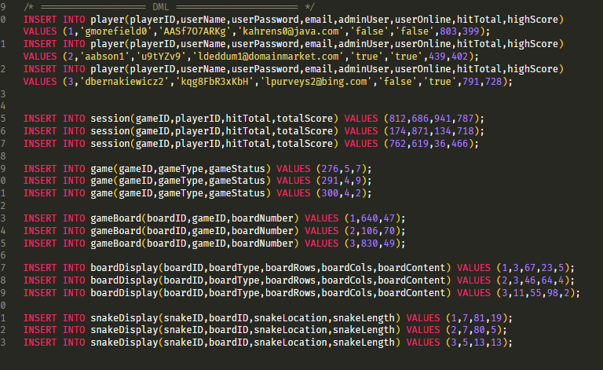

# MILESTONE ONE

## GAME DESCRIPTION

> ### BASE IDEA

The idea for this game is a multiplayer version of snake. The game will be a point based competition to see how many times a player can pick up the food without running into themselves, other players, or other obstacles. Levels will be point based and a minimum number of points must be collected before moving onto the next level. A leaderboard will be created tp represent the top scores.

> ### LOGGING IN
 
When the game is first accessed users will be asked to login, if a user account does not already exist for the user they may choose to create a new one. If the user attempts a login but it fails, then an error will appear asking them to check their username, password, or to create a new user.

> ### GAME LOBBY

Once the user is logged in they will be directed to a game lobby. The game lobby will host the levels and games currently available to them. A list of other users currently online will be visible as well. The user will have the choice to either join a current game or create a new one.

> ### GAMEPLAY

When the user enters gameplay they will be presented with a game screen that consists of current players, their scores, and other players snake character. Other players snakes will appear as a different color than their own and appear with a slight opacity to help distinguish them. Small collectible 'food' items will appear randomly on the board and when collected by a player will add a specific value to the players current score. Game levels will be distinguished by total points needed to complete, and the final level will be an  endless game that continues as long as the player doesn't collide with themself or with other players

> ### TWO PLAYER GAMES

Two player games will involve any two players competing in the same level for the points required to finish the level. When one of the players reaches the required score the game will end, and the player that reached the required score will continue to the next level while the losing player must restart the level. 

> ### OBJECTIVE AND SCORING
 
The objective of the game is simple, collect the food items to receive the points required to complete a level. Most levels will have a standard number of points assigned to a single food item. A special section of duel games will also be created with options to assign random values to food items and determine the score needed to complete the level.

> ### ADMINISTRATORS

A small group of users will be given administration rights and access to admin controls for games, users, and database related operations.

## STORYBOARDS

> ### LOGIN

The login screen will consist of an email and password input submitted via 'Login' button. There will also be a link to the register page. These storyboards are currently not styled, but the final design will be more aesthetically pleasing.

If a user tries to sign in with an email that is not registered, an error message will be displayed above the inputs. A similar message will be displayed if the password is incorrect.

> ### REGISTER

The registration screen will consist of a name, email, and password input submmited via the 'Register' button. There is also a link back to the login page incase a user navigates to the register page by accident

A number of different error warning will be displayed if information is input incorrectly or incompletely.

- Please fill out this field. (blank or incomplete Name, Email, or Password)
- Please enter a valid Email format. (invalid Email format)
- Please enter a password with at least 8 characters, including 1 uppercase letter, 1 lowercase letter, and 1 number (invalid password format)

> ### GAME LOBBY

The game lobby will consist two parts, the game portal(shown above) and the message board(shown below).

The game portal will allow players to create new games or join current games via a unique game code.

The message board will consist of a display area where messages are shown and a text input where the messages are entered. A list of current users will be displayed to the side of the message board. The bulk of the chat features will be run via [Socket.io](https://socket.io/), a useful real-time and event-based communication framework. The message board will be visible in the game lobby as well as during actual gameplay.

> ### GAME BOARD

The current game play display will look similar to the image above, but some colors will change to better differntiate between players and items. The game ID will be displayed above the game, and the score will be displayed below. If a second player joins, then their score will be shown along side the first players score.

- first player is shown as the red snake
- second player is shown as the grey snake
- the apple is shown as the orange square

> ### ADMIN CONTROLS

A screen for admin controls can be accessed by specific users with admin privelges. From the admin control screen they are able to create and delete users, create and delete current games, monitor the message board, and access most user info.

## ENTITY RELATIONSHIP DIAGRAM
[ERD DRAWIO FILE](../ms1/files/ERD.drawio) for better viewing

I am aware that my ERD is missing some complexity. This is my third attempt at the ERD and I decided to dumb everything down to maintain simplicity. I am anticipating some parts to change and for additional tables to be added as the project further progresses along. 

## CRUD TABLE
[CRUD PDF](../ms1/files/ERD.drawio) for better viewing

The diferrent entities are displayed on the left handside in dark grey and the attributes are listed along the top in green. The beginning of an entity table is designated by a light blue row.

My CRUD table is based from the example given in class. I anticipate mulitple modifications as the project continues.

## SQL

[link to myGame.sql file](../ms1/files/myGame.sql)

These DDL statements will ultimately be modified as the project continues. For now this code will act as boilerplate for future modifications.

> #### DDL

> #### DML

============================================================================================================================

# MILESTONE TWO

> # PROJECT REALIGNMENT DEFENSE

I have decided to realign this assessment with my direction as an aspiring blockchain developer. I am currently focused on learning Haskell, Plutus, and Solidity outside of classes because I firmly believe that blockchain technology and decentralised database structures will become much more prevalant in the future. I am not suggesting that decentralised databases will render centralised databases obselete, but I am confident that blockchain technology is and will continue to emerge as a powerful technology. 

I really struggled to piece the classes and class content together, and if I am required to 'teach myself' large chunks to be able to complete the assessment, then I would much prefer to learn a tech stack more inline with my future plans as a smart contract developer. I will provide information and examples that meet some or most of the requirements already defined by the milestones. I will adjust my project to meet the requirements, as it is obviously not fair to expect the curriculim to change for me.

> ### TECH STACK USED

<!-- add links -->
> - [Node.js](https://nodejs.org/en/) - Javascript runtime.
> - [Web3.js](https://web3js.readthedocs.io/en/v1.3.4/) - Collection of js libraries used to interact with the ethereum network.
> - [Solidity](https://soliditylang.org/) - a statically-typed curly-braces programming language designed for developing smart contracts that run on ethereum network.
> - [metamask](https://metamask.io/index.html) - A browser extension that allows the browser to access the ethereum virtual network, also know as EVN, and interact with the blockchain as a wallet.
> - [Truffle](https://www.trufflesuite.com/) - Development environment, testing framework and asset pipeline for blockchains.
> - [Ganache](https://www.trufflesuite.com/docs/ganache/quickstart) - Development blockchain used for developing and testing smart contracts without having to deploy them.
> - [React.js](https://reactjs.org/) - Front-end framework.

> ### NEW GAME OUTLINE

The new game will be a decentralised app, also known as a dApp, that contains a memory tile game. When a user matches two tiles they will automatically be given a non=fungible token, also known as an NFT, of the tiles they have just matched. The first iteration of the game will be single player, and will contain a chat room and highscores leaderboard. A second iteration of a multiplayer game will begin development after certain requirements are achieved for the single player game. 

There are a large number of different blockchains currently in existence, that could be used for this assessment. Ethereum is by far the biggest and most popular of them all, so the tech stack used is specific for interacting with the EVN. But the overlaying concepts could be applied in the same way with most blockchains.

A major concern when realigning this assessment was that in order for a user to interact with the EVN they must pay gas fees, usually in the crypto currency ETH. This provides financial reimbursment for the nodes that run the EVN. Luckily, with the Ganache development suite, a local blockchain is simulated and can be used for developing and testing without requiring any actual fees to be paid to the EVN.

## PROCEDURES

The procedures used to create, retrieve, update, and delete data will be significantly different than using a centralised relational database. The ethereum virtual network (EVN) and interplanetary file system (IPFS) will be used to complete all CRUD procedures required.

### GAME PLAY

A player will be given a set time limit to find as many matches within a set of tiles randomly distributed across the screen. Any match they find within the time limit will be minted as an ERC721 NFT and sent directly to their metamask wallet.

### REGISTRATION

Since Metamask is required to access the EVN, the unique wallet address can be used as the users credentials. This means that a user will not have to register or login with credentials specific to the game. They only need to have a Metamask wallet.  

The advantage of using the wallet for player credentials is that a user can securely access all dApps across the EVN with a single wallet. The wallet itself can store crypto coins and also ethereum related data, such as public addresses and private keys. The wallet allows user to access the EVN and essentially turns a browser or mobile app into an EVN browser.

Metamask security uses a 12-word seed phrase to secure a users wallet. The only person that knows this phrase is the user, and so the security of the wallet relies on the user protecting their seed phrase. A common phrase in crypto is "not your keys, not your crypto", which has a two levels to it. The first is when using a third-party to store crypto, such as an exchange or broker. And the second meaning is that if you are not the only one that knows your key, then you are also not the only one that can access your wallet.

### PLAYER SELECTION

This section will be replaced with game level selection. The more difficult a level is, the more tiles will be displayed making it more difficult for the user to find within the time limit. More valuable tiles will also be assigned to the more difficult levels. Player records and additional data will be kept on the IPFS. Player data could be stored on the EVN as well, but IPFS is a fascinating and promising tech that I would like to incorporate into this project.

<!-- insert screenshots of code for mm address and basic ipfs storage and retrieval -->

### CONFIRMATION

Blockchains and smart contracts are immutable, so it is imperative that smart contracts be tested rigorously before deploying to the actual EVN. This process ensures that everything is verified before any data transactions occur. This process reduces data transmission, bandwidth used, resources required, and possiblity for user error.  

### GAME ADMIN

An admin account will not be necessary. EVN smart contracts and the blockchain blocks are immutable, so any admin options or actions must be considered prior to smart contract deployment. The player data stored on IPFS will also only be modified through smart contracts that monitor user activity.

## ACID

nevermind. i cant do this project anymore.

### ATOMICITY

### CONSISTENCY

### ISOLATION

### DURABILITY

## TESTS

============================================================================================================================

# MILESTONE THREE

The work from my prior incomplete project attempts are shown above.

The code from my initial project attempt can be found [here](../ms1/src/).

[A live demo of the above code](https://serene-allen-15272d.netlify.app/), if you open it in two different browsers an initial multiplayer game can be started. Game logic was never completed and the game was never connected with a database, so only the game creation, connection via [Socket.io](https://socket.io/), and game start currently work.

The initial code for  my decentralized project attempt can be found [here](../ms2/src/).

The code that was worked on in the final weeks can be found [here](./src/).

## MS3

There are no sketches of interactions because I could not get that far in my third attempt at this project.

The third attempt of the game was snake written completely in MySQL. But is not much farther than the basic DDL and some basic DML. There is no GUI or report on how I refined my project.

I did not extend my work into a series of windows forms.

I did not create a class that has methods for each of my previously defined SQL database procedures.

I did not implement one genuine interaction in the prototype, unless aspects of the first or second project attempt are considered. 
